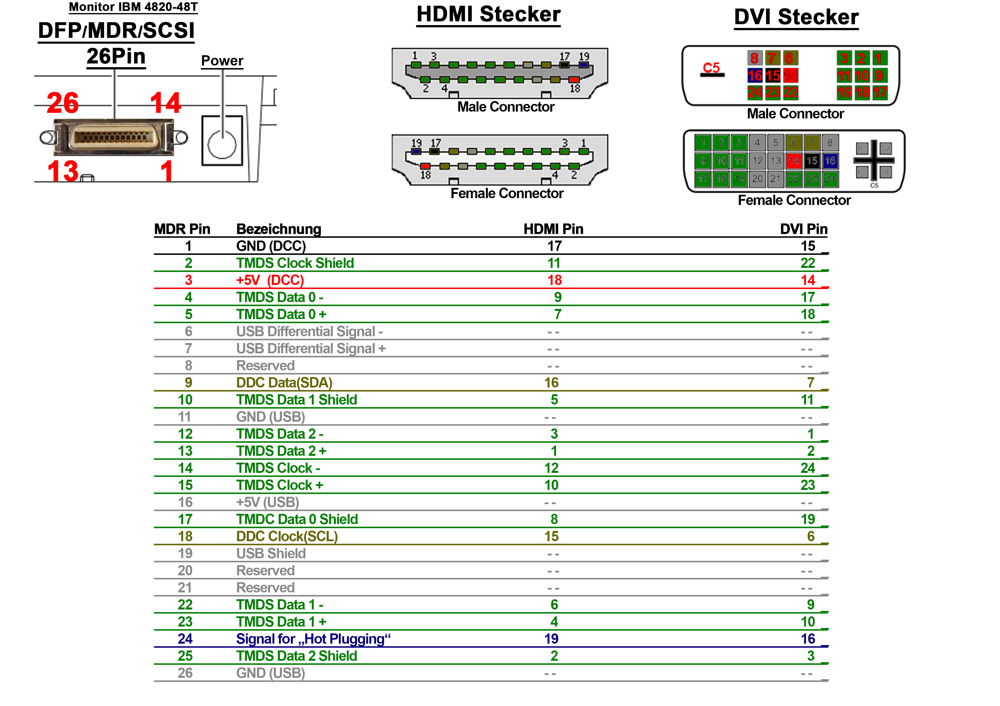
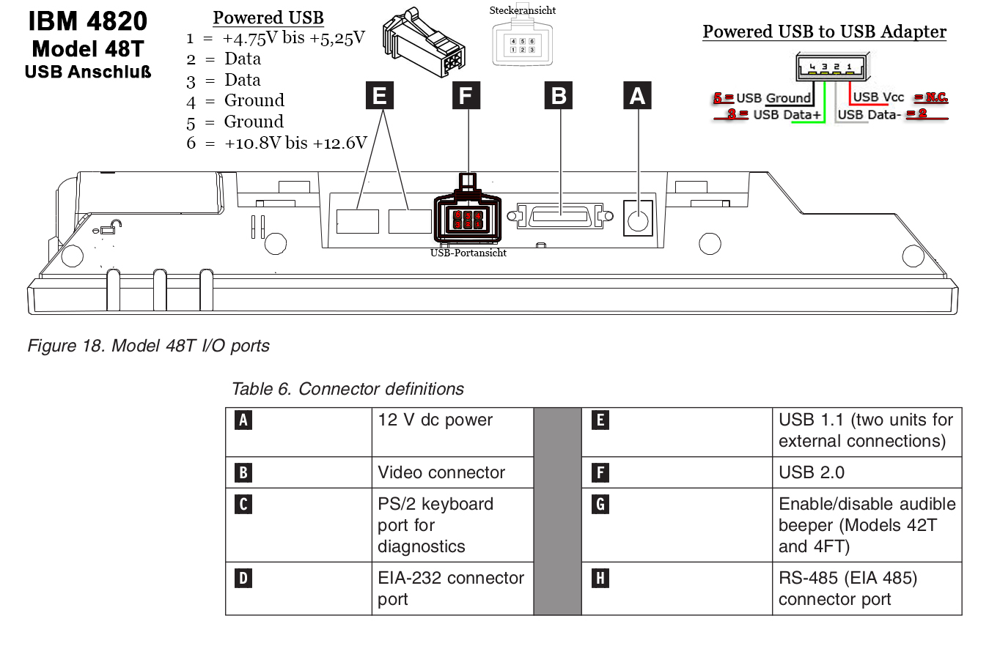

# Infos, Pinouts and Driver of the Surepoint POS Touch-Monitor 8240-48T
 
DIY HDMI / DVI Adapter 
 
 
DIY USB-Cable 
 
 
PDF's From IBM 
<a href src="IBM 4820 Planning%2C Installation And Service Manual.pdf">IBM 4820 Planning, Installation And Service Manual.pdf</a> 
<a href src="IBM 4820 Planning%2C Installation And Service Manual_touch.pdf">IBM 4820 Planning, Installation And Service Manual_touch.pdf</a> 
<a href src="IBM 4820 System Reference Manual.pdf">IBM 4820 System Reference Manual.pdf</b> 
 
Infos of the Display-Protokols DISM, TMDS, LVDS and LDI 
<a href src="Digital_Interface_Standards_for_Monitors.pdf">Digital_Interface_Standards_for_Monitors.pdf</a> 

